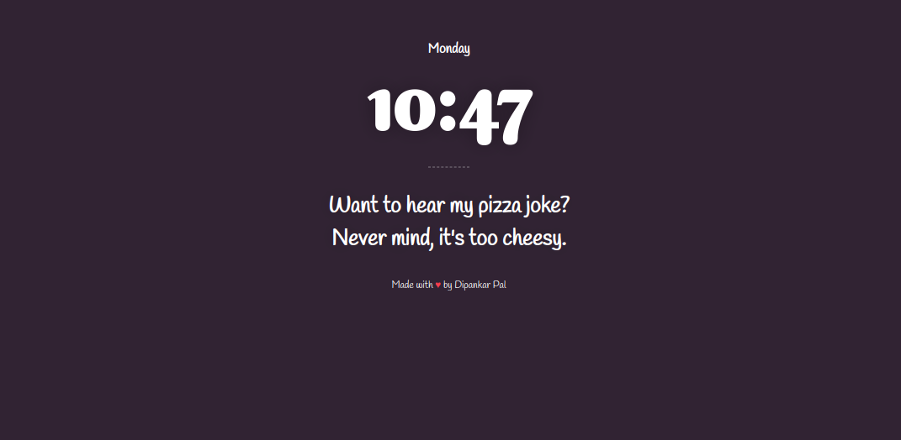

  
  

   
  
  
 

  

  <h4 align=center > Random Joke On Chrome New Tab</h4>
  

  

## Install
1. Download the extension from [here](https://github.com/deep5050/one-more-joke-please/releases/download/v1.0/one-more-joke-please-v1.0.crx)
2. Goto `chrome://extensions/`
3. Drop the downloaded file there or just double click to open
4. No step 4!

## Roadmap

See the [open issues](https://github.com/deep5050/one-more-joke-please/issues) for a list of proposed features (and known issues).

## Version History

`v1.0.0`: First release

## Support

All Kinds Of Supports Are Welcome :raised_hands:! The Most Basic Way To Show Your Support Is To Star :star2: The Project, Or To Raise Issues :speech_balloon: You Can Also Support This Project By [**becoming a sponsor on GitHub**](https://github.com/sponsors/deep5050) :clap: Or By Making A [**Paypal**](https://paypal.me/deep5050) Donation :)

<!-- LICENSE -->
## License

Distributed under the GPL v3 License. See `LICENSE` for more information.

<!-- CONTACT -->
## Contact

Dipankar Pal - dipankarpal5050@gmail.com

## Related Works
[NaughtyLust](https://github.com/deep5050/NaughtyLust) : Awesome Nautilus Scripts For Linux.

[qikQR](https://github.com/deep5050/qikQR) : Minimal QR Code Generator App Made With Electron.

[cppcheck-action](https://github.com/deep5050/cppcheck-action) : Check Security Flaws In Your C/C++ Codes Right From GitHub Action Workflows.

[autopy-lot](https://github.com/deep5050/autopy-lot) : GitHub Action Setup To Convert Jupyter Notebooks To Python Scripts And Markdowns.

Happy Coding

  

  

